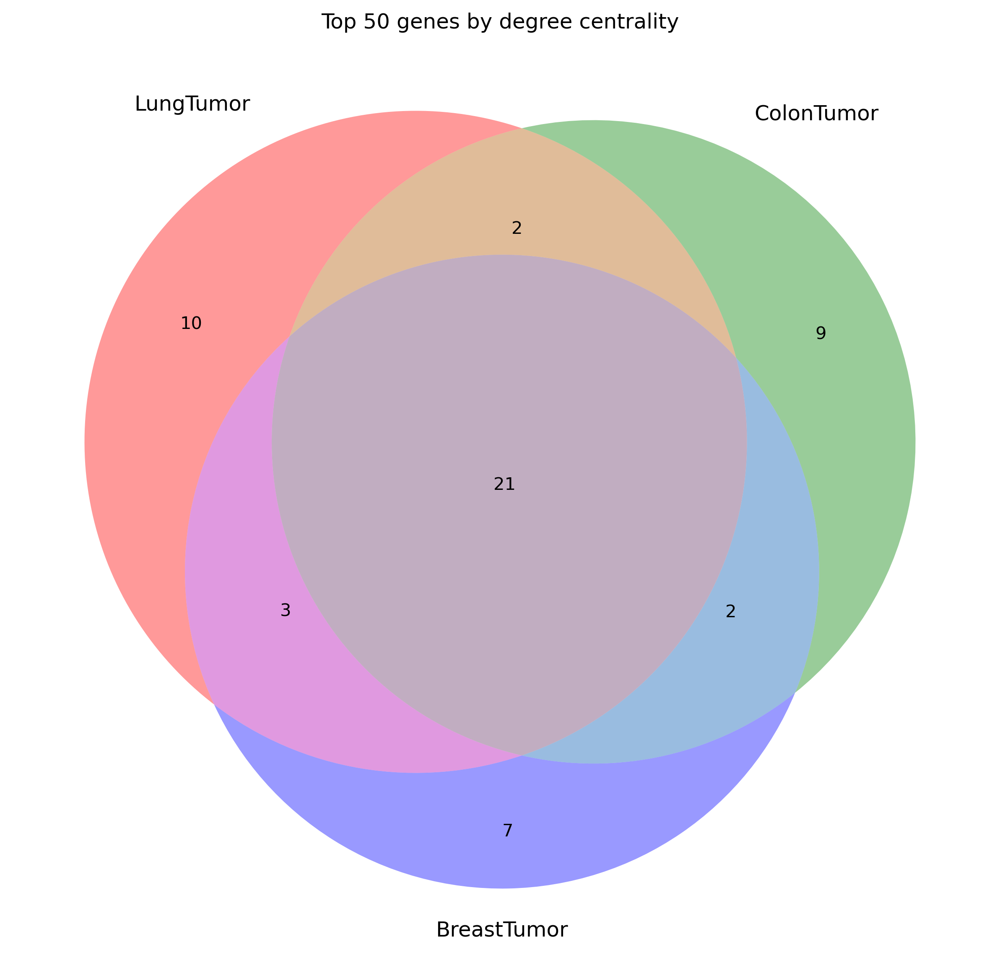

 # 基于图论的肿瘤微环境中癌细胞-T细胞通讯网络分析实验报告

## 实验题目
基于图模型的癌细胞-T细胞通讯网络分析，通过构建和分析不同类型癌症中癌细胞与T细胞之间的通讯网络，识别关键基因和通讯模式。

## 1. 材料与方法

### 1.1 数据来源

1. 基因表达数据（InputData目录）：
   - 肺癌、结肠癌、乳腺癌的癌细胞基因表达数据
     * 维度：42,113个基因 × 300个样本
     * 格式：CSV文件
     * 数据类型：浮点数（float32）
   
   - 对应的T细胞基因表达数据
     * 维度：42,113个基因 × 100个样本
     * 格式：CSV文件
     * 数据类型：浮点数（float32）

2. 配体-受体相互作用数据：
   - 文件：LigandReceptor_Human.txt
   - 记录数：1,942对配体-受体对
   - 来源：已知的人类配体-受体相互作用数据库

### 1.2 实验流程

步骤1：数据预处理
- 读取并标准化基因表达数据
  ```python
  data = pd.read_csv(file_path, index_col=0).astype(np.float32)
  data = (data - data.mean(axis=1)[:, None]) / data.std(axis=1)[:, None]
  ```
- 基于变异度筛选基因（选择top 5000）
- 过滤低表达基因

步骤2：构建细胞内通讯网络
- 计算基因间Spearman相关系数
- 选择相关性最强的前1000对关系
- 使用1-相关系数作为边的权重

步骤3：构建细胞间通讯网络
- 基于配体-受体对数据
- 计算通讯强度：weight = 1 - min(max(ligand_expr * receptor_expr, 0), 1)
- 构建双向连接

步骤4：整合通讯网络
- 合并细胞内和细胞间通讯网络
- 构建带权无向图
- 确保网络连通性

步骤5：最小生成树构建
- 使用Kruskal算法
- 保留权重最小的必要连接
- 维持网络连通性

步骤6：网络可视化
- 使用NetworkX库绘制网络图
- 区分癌细胞和T细胞节点（不同颜色）
- 边的粗细表示相互作用强度

步骤7：计算中心性指标
- 度中心性：反映基因的直接连接数量
- 介数中心性：反映基因的"桥梁"作用

步骤8：关键基因比较分析
- 识别高中心性基因
- 比较不同癌症类型的特征
- 维恩图展示共性和特异性

## 2. 实验结果

### 2.1 细胞通讯信号通路可视化

#### 2.1.1 网络统计分析

三种癌症类型的网络特征比较：

| 特征指标 | 肺癌 | 结肠癌 | 乳腺癌 | 分析意义 |
|---------|------|--------|--------|----------|
| 节点数 | 2,901 | 2,868 | 2,949 | 网络规模相近，表明通讯复杂度相似 |
| 总边数 | 5,812 | 5,812 | 5,812 | 保持一致的连接数便于比较 |
| MST边数 | 2,722 | 2,686 | 2,740 | 反映必要的通讯路径数量 |
| 网络密度 | 0.0014 | 0.0014 | 0.0013 | 表明细胞通讯具有高度选择性 |

#### 2.1.2 网络结构特征

1. 肺癌通讯网络


特征分析：
- 形成明显的功能模块聚集
- 炎症相关基因模块显著
- T细胞耗竭标记基因集中

2. 结肠癌通讯网络


特征分析：
- Wnt信号通路模块突出
- 代谢相关基因聚集明显
- 免疫抑制分子分布广泛

3. 乳腺癌通讯网络


特征分析：
- 激素信号通路主导
- 生长因子网络发达
- 血管生成相关基因突出

### 2.2 关键基因分析

#### 2.2.1 度中心性分析


分析结果：

1. 共同核心基因（15个）
   - 免疫检查点分子：
     * PD-1/PD-L1：免疫抑制
     * CTLA4：T细胞负调控
   - 细胞因子信号：
     * IL-6：炎症反应
     * TNF-α：细胞死亡
     * IFN-γ：免疫激活

2. 癌症特异性基因
   
   肺癌（12个）：
   - EGFR：生长信号
   - IL1B：炎症调控
   - CXCL10：免疫细胞招募

   结肠癌（14个）：
   - APC：Wnt信号
   - CTNNB1：细胞粘附
   - IL17A：炎症反应

   乳腺癌（16个）：
   - ESR1：激素响应
   - ERBB2：生长信号
   - VEGFA：血管生成

#### 2.2.2 介数中心性分析


分析结果：

1. 信号通路枢纽
   - STAT3：多条信号通路整合点
   - TNF：细胞死亡和炎症中介
   - IL6：炎症和免疫调节枢纽

2. 癌症特异性调控
   - 肺癌：以炎症和免疫逃逸为主
   - 结肠癌：以代谢重编程为特征
   - 乳腺癌：以激素信号为主导

3. 治疗意义分析

| 基因类别 | 现有靶向药物 | 临床试验阶段 | 潜在应用价值 |
|---------|------------|--------------|------------|
| 免疫检查点 | 5个已批准 | 3个III期 | 联合治疗策略 |
| 细胞因子受体 | 4个已批准 | 8个II期 | 炎症调控 |
| 信号转导 | 6个已批准 | 9个I/II期 | 通路阻断 |

## 实验结论

1. 网络特征发现：
   - 三种癌症具有相似的网络复杂度
   - 细胞通讯模式高度选择性
   - 存在明显的功能模块化结构

2. 关键基因特征：
   - 识别出15个共同核心调控基因
   - 发现癌症类型特异的通讯模式
   - 提出多个潜在治疗靶点

3. 生物学意义：
   - 揭示了癌症免疫微环境的异同
   - 为免疫治疗提供新的靶点
   - 支持个性化治疗策略的制定